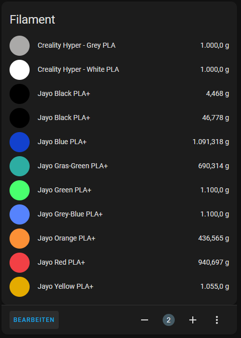
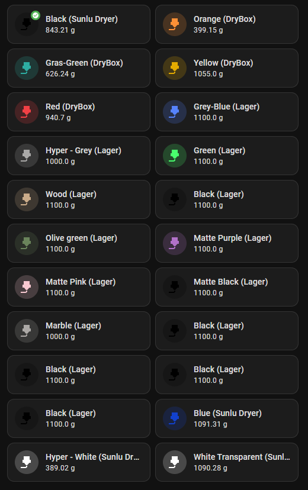
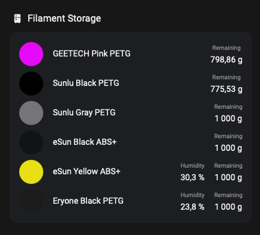

[](https://github.com/hacs/integration)
[](https://github.com/Disane87/spoolman-homeassistant/actions/workflows/validate.yml)


[](https://github.com/semantic-release/semantic-release)


# 🎯 Spoolman Home Assistant Integration

Hey there! 👋 This integration brings [Spoolman](https://github.com/Donkie/Spoolman/) into your Home Assistant setup. Keep an eye on your filament spools and get notified before you run out of material mid-print! 🖨️✨

> [!CAUTION]
> ## ⚠️ HEADS UP - Smooth Migration Path Available! 🛤️
>
> **We've made some awesome improvements! Don't worry - your existing setup will keep working! 🎉**
>
> ### 🆕 What's New?
> - 🏠 **Better Device Structure**: Each spool is now its own device (much cleaner!)
> - 📊 **25+ New Sensors**: Dedicated sensors for every Spoolman data field
> - 🔄 **100% Backward Compatible**: Your main sensor still outputs ALL attributes - nothing breaks!
> - 🌳 **Smart Hierarchy**: Locations act as "hubs" with spools as children
>
> ### 🎯 Take Your Time - No Rush! ⏰
> **The main sensor (`sensor.spoolman_spool_[id]`) still does everything it did before.** So relax! 😌
> - ✅ **Your automations? Still working!** - no need to change anything right away
> - ✅ **Your dashboards? Still working!** - all attributes are exactly where you left them
> - ✅ **Your services? Yep, still working!** - `spoolman.patch_spool` and `spoolman.use_spool_filament` unchanged
> - ⏰ **Migrate whenever you want** - switch to the new sensors when it suits you!
>
> ### 🎁 Cool New Sensors Available!
> Each spool now has dedicated sensors for all this awesome data:
> - ⚖️ **Measurements**: Weight (used & remaining), length (used & remaining), usage %, flow rate, estimated run-out
> - ⏰ **Timestamps**: When registered, first used, last used
> - 📝 **Metadata**: Price, spool weight, lot number, comments, location
> - 🧵 **Filament Properties**: Name, material, color hex, vendor, density, diameter
> - 🌡️ **Print Settings**: Extruder temp, bed temp, article number, weight
> - 🆔 **Basic Info**: Spool ID
>
> ### 💡 Why You Might Want to Migrate (Eventually!)
>
> #### 📜 Old Way (Still Works Fine!)
> ```yaml
> trigger:
>   - platform: template
>     value_template: "{{ state_attr('sensor.spoolman_spool_1', 'used_weight') > 500 }}"
> ```
>
> #### ✨ New Way (Faster & Cleaner!)
> ```yaml
> trigger:
>   - platform: numeric_state
>     entity_id: sensor.spoolman_spool_1_used_weight
>     above: 500
> ```
>
> ### 🚀 Why Bother Migrating?
> - **⚡ Faster Home Assistant**: Smaller state objects = smoother experience!
> - **💾 Database Stays Happy**: No more bloated state attributes
> - **🎯 Simpler Automations**: Native sensor triggers - no more templates!
> - **📈 Better History Graphs**: Each sensor tracks its own history
> - **🔍 Easier to Debug**: Clear names tell you exactly what you're looking at
>
> ### 🎬 What to Do After Updating
> 1. 🔄 Restart Home Assistant (you knew that was coming!)
> 2. 👀 Check **Devices & Services** - see your spools organized under location hubs
> 3. 🔍 Explore all the shiny new sensors in your spool devices
> 4. 🎨 Update automations whenever you feel like it (totally optional!)
> 5. 📊 Update dashboard cards at your own pace (also optional!)
>
> ### 🔍 The Technical Bits
> - ✅ **Entity IDs unchanged**: `sensor.spoolman_spool_[id]` is still there!
> - ✅ **All attributes present**: Main sensor still outputs everything via `state_attr()`
> - 🆕 **Extra sensors added**: Same data, just more efficient now
> - 🏗️ **Better organization**: Spools grouped under location hubs
>
> Questions? Run into issues? [Open an issue](https://github.com/Disane87/spoolman-homeassistant/issues) - we're here to help! 💬

# ✨ What Can This Thing Do?

Glad you asked! Here's the good stuff:

- 📊 **25+ Sensors Per Spool**: Every piece of data from Spoolman, right in Home Assistant
- 🔄 **Plays Nice With Old Stuff**: Existing automations keep working - promise!
- 🏠 **Smart Device Structure**: Each spool gets its own device, organized under location hubs
- 📏 **All The Measurements**: Weight, length, usage percentage - we got 'em all!
- ⚡ **Flow Rate Tracking**: See how fast you're burning through filament (g/h)
- ⏰ **Run-Out Predictions**: Know when you'll run out before it happens
- 📍 **Location Selector**: Move spools around with a simple dropdown
- 🚨 **Smart Alerts**: Set thresholds for info, warning, and critical states
- 📦 **Archive Support**: Old spools? Group them in an "Archived" device
- 🖨️ **Klipper Integration**: Track active spools in your Klipper setup
- 🤖 **Automation Services**: `patch_spool` and `use_spool_filament` for automation magic
- 🎯 **Auto Areas**: Assigns device areas automatically (won't overwrite yours!)
- 💾 **Database Friendly**: Dedicated sensors = no more bloated databases

> [!NOTE]
> 🔔 **Threshold Events**: When a threshold is hit, we fire a `spoolman_spool_threshold_exceeded` event. You get three levels to play with: `info`, `warning`, and `critical`.


> [!IMPORTANT]
> ⚠️ **One Alert Per Restart**: Each threshold only fires once per spool until you restart Home Assistant. This prevents notification spam! 😅

# 📦 Installation

Super easy! Just add this repo to your HACS custom repositories ([how?](https://hacs.xyz/docs/faq/custom_repositories/)) and boom - you'll see it in HACS where you can grab the latest version! 🎉

# 🚀 Getting Started

Ready to roll? Here's how to set it up:

1. Add a new integration for Spoolman
2. Drop in your Spoolman URL
3. That's it! 🎉


You'll now see your Spoolman setup with devices organized by location, plus all your archived spools neatly grouped together:


Each spool gets a sensor showing its actual color (pretty cool, right? 🎨), plus we track weight and length in real-time.

All the juicy details from Spoolman are tucked into the sensor attributes:


## ⚡ Flow Rate Sensor

Each spool tracks how fast you're using filament in real-time (grams per hour). Super useful for:
- 📈 Keeping tabs on your printing speed
- 👀 Spotting when something's using too much filament
- 🤖 Building smart automations based on usage patterns
- ⏰ Predicting when you'll run out (more on that below!)

The sensor starts at 0 g/h and kicks in once it detects filament being used. We calculate the rate by watching weight changes over time.

## ⏰ Estimated Run Out Sensor

This one's a fortune teller! 🔮 It predicts when your filament will run out based on current usage.

**What you get:**
- 📅 **State**: When you'll run out (ISO 8601 timestamp)
- 📊 **Attributes**:
  - `hours_remaining`: How many hours until "uh oh, no filament!"
  - `days_remaining`: Same, but in days
  - `flow_rate`: Current burn rate (g/h)
  - `remaining_weight`: What's left (g)

Note: The sensor needs active flow data to make predictions. No usage = no prediction (shows `None`).

**Why this rocks:**
- 📝 Plan your print queue around available material
- 📦 Automate reordering before you run out
- 👀 Keep tabs on marathon prints
- 🛠️ Schedule filament changes in advance

## 📍 Location Selector

Moving spools around? We made it super easy! Each spool has a dropdown selector - just pick a new location and boom, it's moved in Spoolman! No need to mess with services. 🎯

## 🏗️ How It's Organized

We've structured things to make your life easier:
- 🏠 Each spool is its own device
- 📍 Locations are "hub" devices that group spools
- 📦 All sensors for a spool live under that device
- 💾 Database stays lean with dedicated sensors
- 🔄 Your old entity IDs still work!

> [!IMPORTANT]
> Your spool needs at least a name and a material to get added to Home Assistant.

# 🏷️ Entity Names

We keep it simple and consistent! Every spool gets an entity ID like `sensor.spoolman_spool_[id]`. Why IDs instead of names?
- 🎯 No confusion when multiple spools have the same name
- 🔍 Easy to find (everything starts with `spoolman`)
- 🚫 No conflicts with other integrations

**Here's what you get for each spool:**
- `sensor.spoolman_spool_[id]` - Main sensor showing remaining weight (minimal attributes)
- `sensor.spoolman_spool_[id]_used_weight` - Used weight sensor (g)
- `sensor.spoolman_spool_[id]_remaining_length` - Remaining filament length (mm)
- `sensor.spoolman_spool_[id]_used_length` - Used filament length (mm)
- `sensor.spoolman_spool_[id]_location` - Current location as text sensor
- `sensor.spoolman_spool_[id]_used_percentage` - Percentage of filament used (%)
- `sensor.spoolman_spool_[id]_flow_rate` - Flow rate sensor tracking consumption in g/h
- `sensor.spoolman_spool_[id]_estimated_runout` - Timestamp sensor showing when spool will run out
- `select.spoolman_spool_[id]_location` - Location selector for quick location changes

> [!NOTE]
> 🆕 **New in this version**: Each spool is now its own device with dedicated sensors. This keeps your database happy by not stuffing everything into state attributes! 💾✨

# 🎨 Making It Look Good

Want to show off your spools in Lovelace? Here are some ideas!

## Basic Entities Card
The default entities card works great:



## 🚀 Fancy Dynamic Cards

Want something more powerful? Try combining:
- [auto-entities-card](https://github.com/thomasloven/lovelace-auto-entities) - Dynamically shows all your spools
- [mushroom-template-card](https://github.com/piitaya/lovelace-mushroom/blob/main/docs/cards/template.md) - Beautiful, customizable cards

Here's a sweet example that shows all your spools with colors, locations, and badges:
```yaml
type: custom:auto-entities
filter:
  include:
    - integration: '*spoolman*'
      sort:
        method: attribute
        attribute: location
        reverse: false
      attributes:
        archived: false
      options:
        type: custom:mushroom-template-card
        vertical: false
        icon_color: '#{{ state_attr(entity, ''filament_color_hex'') }}'
        icon: mdi:printer-3d-nozzle
        badge_icon: |
          
            mdi:archive
          
            mdi:check-circle
          
        badge_color: |
          
            orange
          
            green
          
            default_color
          
        primary: |
           
            {{ state_attr(entity, 'filament_name') }} ({{ location }})
          
            {{ state_attr(entity, 'filament_name') }}
          
        secondary: '{{ (state_attr(entity, ''remaining_weight'') | float)  | round(2) }} g'
        tap_action:
          action: more-info
sort:
  method: attribute
  attribute: klipper_active_spool
  reverse: true
card:
  type: grid
  columns: 2
  square: false
card_param: cards

```
**What this card does:**
- 📦 Hides archived spools (or shows them with an orange badge)
- 💚 Active Klipper spool? Gets a green badge and goes first!
- 🔤 Sorts by location alphabetically
- 📍 Shows location right in the name
- 👆 Click for more details!



# 🤖 Automation Ideas

Let's get creative! Here's an example that notifies you when a spool is running low:
```yaml
alias: Filament almost empty
description: ""
trigger:
  - platform: event
    event_type: spoolman_spool_threshold_exceeded
condition: []
action:
  - service: notify.notify
    data_template:
      title: >-
        {{ trigger.event.data['threshold_name'] | capitalize }}: Spool almost
        empty
      message: >-
        The spool {{ trigger.event.data['spool']['filament']['vendor']['name']
        }} {{ trigger.event.data['spool']['filament']['name'] }} {{
        trigger.event.data['spool']['filament']['material'] }} has reached {{
        trigger.event.data['spool']['used_percentage'] }}% usage
mode: restart

```

## Flow Rate Alert Automations

Monitor your printer's flow rate sensor to detect potential issues like clogs, jams, or leaks. These automations help you catch problems early!

### Alert when flow rate is abnormally high (potential leak or over-extrusion)

This automation triggers when the flow rate exceeds a threshold, which might indicate a leak or over-extrusion issue.

```yaml
alias: Flow Rate Too High Alert
description: "Alert when flow rate exceeds normal levels - possible leak or over-extrusion"
trigger:
  - platform: numeric_state
    entity_id: sensor.spoolman_spool_1_flow_rate
    above: 15  # Adjust threshold based on your typical flow rate (mm³/s)
    for:
      seconds: 10
condition: []
action:
  - service: notify.notify
    data:
      title: "⚠️ High Flow Rate Detected"
      message: >-
        Flow rate is {{ states('sensor.spoolman_spool_1_flow_rate') }} mm³/s.
        This might indicate over-extrusion or a leak. Please check your printer!
mode: single
```

### Alert when flow rate is unusually low (potential clog or jam)

This automation detects when flow rate drops significantly during printing, which often indicates a partial clog or jam.

```yaml
alias: Flow Rate Too Low Alert
description: "Alert when flow rate drops below expected levels - possible clog or jam"
trigger:
  - platform: numeric_state
    entity_id: sensor.spoolman_spool_1_flow_rate
    below: 2  # Adjust threshold based on your typical minimum flow rate (mm³/s)
    for:
      seconds: 30
condition:
  - condition: state
    entity_id: binary_sensor.printer_printing  # Replace with your printer's printing status sensor
    state: "on"
action:
  - service: notify.notify
    data:
      title: "🚨 Low Flow Rate Warning"
      message: >-
        Flow rate has dropped to {{ states('sensor.spoolman_spool_1_flow_rate') }} mm³/s.
        This might indicate a clog or jam. Check your extruder!
mode: single
```

### Track average flow rate over time

Use a statistics sensor to track flow rate patterns and detect gradual degradation.

```yaml
# In your configuration.yaml, add this sensor:
sensor:
  - platform: statistics
    name: "Average Flow Rate (1 hour)"
    entity_id: sensor.spoolman_spool_1_flow_rate
    state_characteristic: mean
    max_age:
      hours: 1
```

Then create an automation to alert on unusual averages:

```yaml
alias: Flow Rate Trending Down
description: "Alert when average flow rate trends lower than normal"
trigger:
  - platform: numeric_state
    entity_id: sensor.average_flow_rate_1_hour
    below: 5  # Adjust based on your typical average
action:
  - service: notify.notify
    data:
      title: "📉 Flow Rate Trending Low"
      message: >-
        Average flow rate over the last hour is {{ states('sensor.average_flow_rate_1_hour') }} mm³/s.
        This might indicate gradual degradation. Consider checking your nozzle or filament path.
mode: single
```


**What data can you use in your automations?** All of this good stuff:
```json
{
    "entity_id": self.entity_id,
    "spool": spool,
    "threshold_name": threshold_name,
    "threshold_value": config_threshold,
    "used_percentage": used_percentage,
}
```

**Here's what a spool looks like** (based on the [Spoolman API](https://donkie.github.io/Spoolman/)):

```json
{
    "id": 1,
    "registered": "2023-09-22T19:52:36Z",
    "first_used": "2023-09-23T04:22:26.975000Z",
    "last_used": "2023-09-30T04:09:34.242017Z",
    "filament": {
        "id": 1,
        "registered": "2023-09-22T19:52:07Z",
        "name": "Black",
        "vendor": {
            "id": 1,
            "registered": "2023-09-22T19:43:26Z",
            "name": "Jayo"
        },
        "material": "PLA+",
        "price": 15.99,
        "density": 1.24,
        "diameter": 1.75,
        "weight": 1100,
        "article_number": "B0BJ1FR86Y",
        "comment": "",
        "settings_extruder_temp": 210,
        "settings_bed_temp": 60,
        "color_hex": "000000"
    },
    "remaining_weight": 4.468290721106769,
    "used_weight": 1095.5317092788932,
    "remaining_length": 1498.1446855790216,
    "used_length": 367313.8366728618,
    "location": "Lager",
    "lot_nr": "1704306141A",
    "archived": false
}
```

# 🛠️ Services for Automation

We've got two powerful services for your automation needs:

## 🔧 `spoolman.patch_spool`

Need to update a spool? This is your friend! Change any property on a spool. Just make sure your `data` matches the [Spoolman API](https://donkie.github.io/Spoolman/#tag/spool/operation/Update_spool_spool__spool_id__patch) format.

> [!IMPORTANT]
> ⚠️ **Heads up!** You can only update EITHER `remaining_weight` OR `used_weight` - not both at once! Spoolman will calculate the other one for you. Smart, right? 🧠

```yaml
service: spoolman.patch_spool
data:
  id: 45
  first_used: "2019-08-24T14:15:22.000Z"
  last_used: "2019-08-24T14:15:22.000Z"
  price: 20
  initial_weight: 200
  spool_weight: 200
  location: Shelf B
  remaining_weight: 200
  lot_nr: 52342
```

## 📏 `spoolman.use_spool_filament`

Just printed something? Track your filament usage automatically! This service subtracts filament from a spool. Data format needs to match the [Spoolman API](https://donkie.github.io/Spoolman/#tag/spool/operation/Use_spool_filament_spool__spool_id__use_put).

Pick either `use_weight` (grams) or `use_length` (millimeters) plus the spool `id`. Easy!

```yaml
service: spoolman.use_spool_filament
data:
  id: 123
  use_weight: 10
```

# 🎯 Extra Fields - Get Creative!

Spoolman supports custom fields, and so do we! They show up in your spool attributes with the `extra_` prefix.

**Cool idea:** Store humidity data from your Home Assistant sensors! Here's an automation that updates humidity for all spools every 15 minutes:

```yaml
alias: Update spoolman
description: ""
mode: single
triggers:
  - trigger: time_pattern
    minutes: /15
conditions: []
actions:
  - repeat:
      for_each: "{{ integration_entities('spoolman') }}"
      sequence:
        - if:
            - condition: template
              value_template: "{{ state_attr(repeat.item, 'extra_sensor') is not none }}"
          then:
            - action: spoolman.patch_spool
              data:
                id: "{{ state_attr(repeat.item, 'id') }}"
                extra:
                  sensor: "{{ state_attr(repeat.item, 'extra_sensor') }}"
                  humidity: >-
                    {{ states("sensor."+state_attr(repeat.item, 'extra_sensor')) }}
```

**Show it off!** Display your custom fields in cards using auto-entities + multiple-entity-row:




# 🤝 Contributing

Hey there! Want to help make this integration even better? That's awesome! 🎉

We'd love to have you on board! Check out our [Contributing Guidelines](CONTRIBUTING.md) for all the details you need:
- 🐳 Dev Container setup (seriously, it's super easy!)
- 🌿 Branching strategy and workflow
- 💬 Commit message conventions (we use conventional commits)
- 🧪 Testing and code quality stuff
- 🚀 How to submit Pull Requests

**🏃‍♂️ Quick Start for Developers:**
- 📦 Use the included Dev Container - everything's ready to go!
- 🌿 Merge PRs to the `dev` branch (PRs against `main` will be rejected)
- 💾 Use [conventional commits](https://www.conventionalcommits.org/en/v1.0.0/) for automatic versioning
- 💻 Visual Studio Code recommended (everything works out of the box)

Don't be shy - we're all learning together! If you have questions, just open an issue and let's chat! 💬

## 🌟 Contributors

A big thank you to everyone who has contributed to this project! Your efforts make this integration better for everyone! 🙌

<!-- ALL-CONTRIBUTORS-LIST:START - Do not remove or modify this section -->
<!-- prettier-ignore-start -->
<!-- markdownlint-disable -->

<a href="https://github.com/Disane87/spoolman-homeassistant/graphs/contributors">
  
</a>

<!-- markdownlint-restore -->
<!-- prettier-ignore-end -->

<!-- ALL-CONTRIBUTORS-LIST:END -->

_Made with [contrib.rocks](https://contrib.rocks)._

# 🎉 Cheers!

Thanks for using this integration! If you like it, give it a ⭐ on GitHub - it really helps! 🙌

Found a bug? Have an idea? Open an issue and let's make this better together! 🚀
